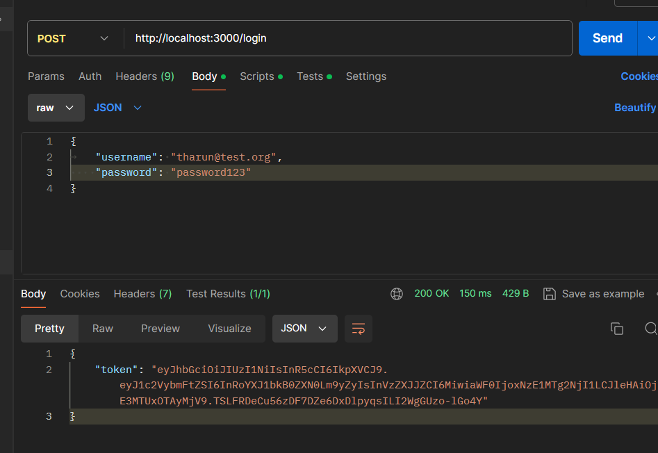
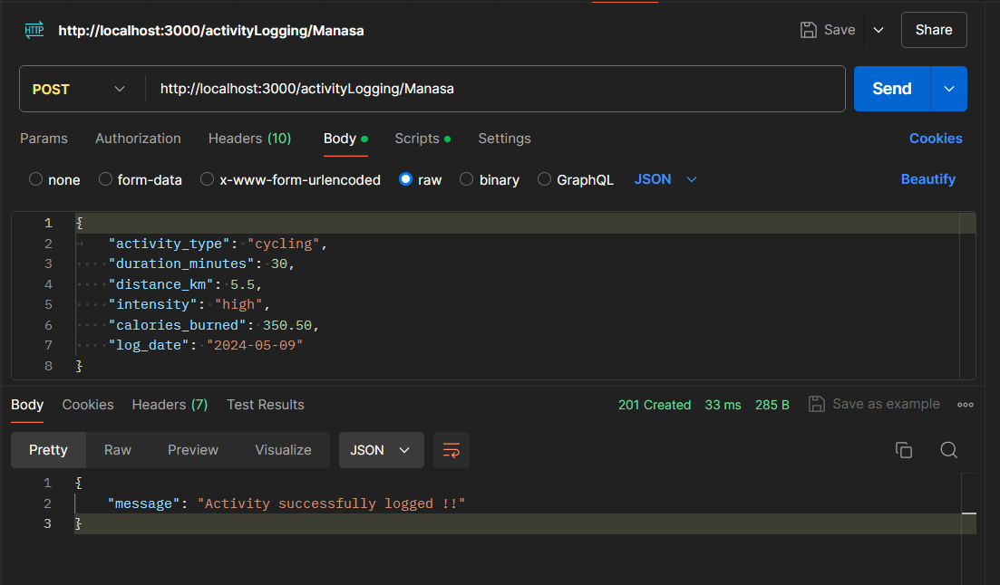
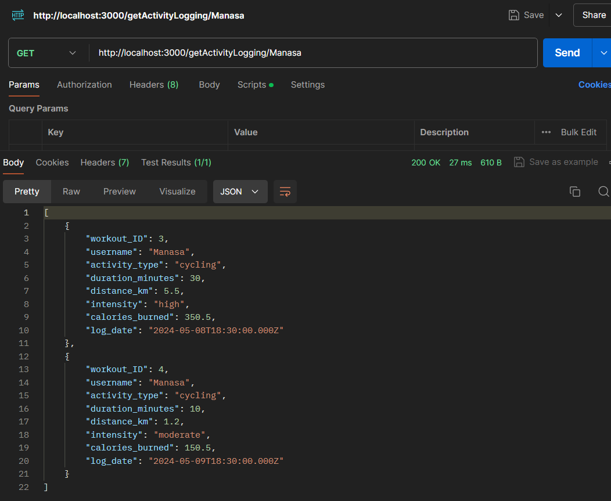
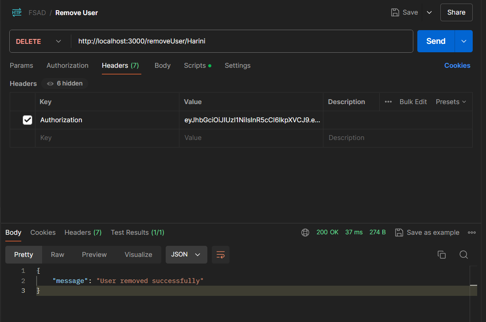

# FullStackAssignment

This repository contains data and code required for Fitness Tracker Web Application

Get User Details

Login user and generate token

Secure login

Invalid password

Log user's fitness activity

Get User's fitness activity

Remove User

